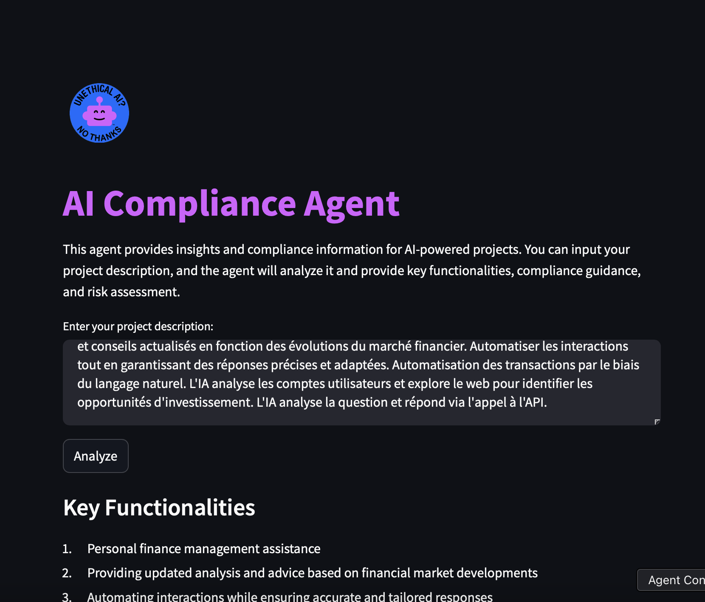
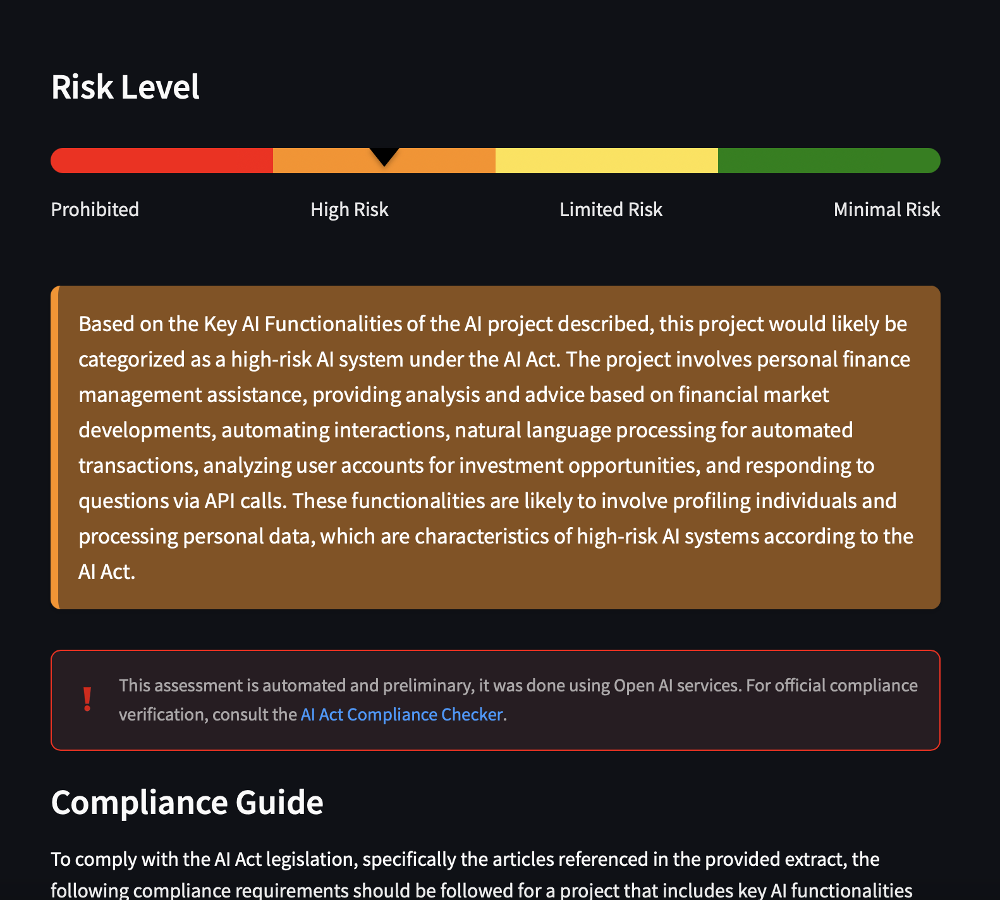
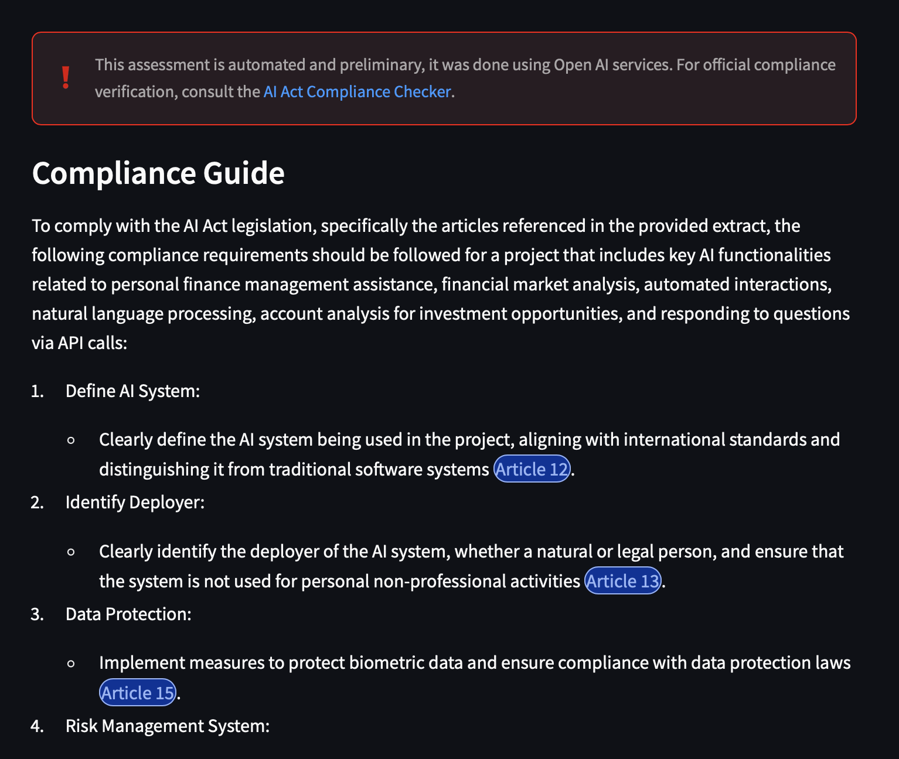
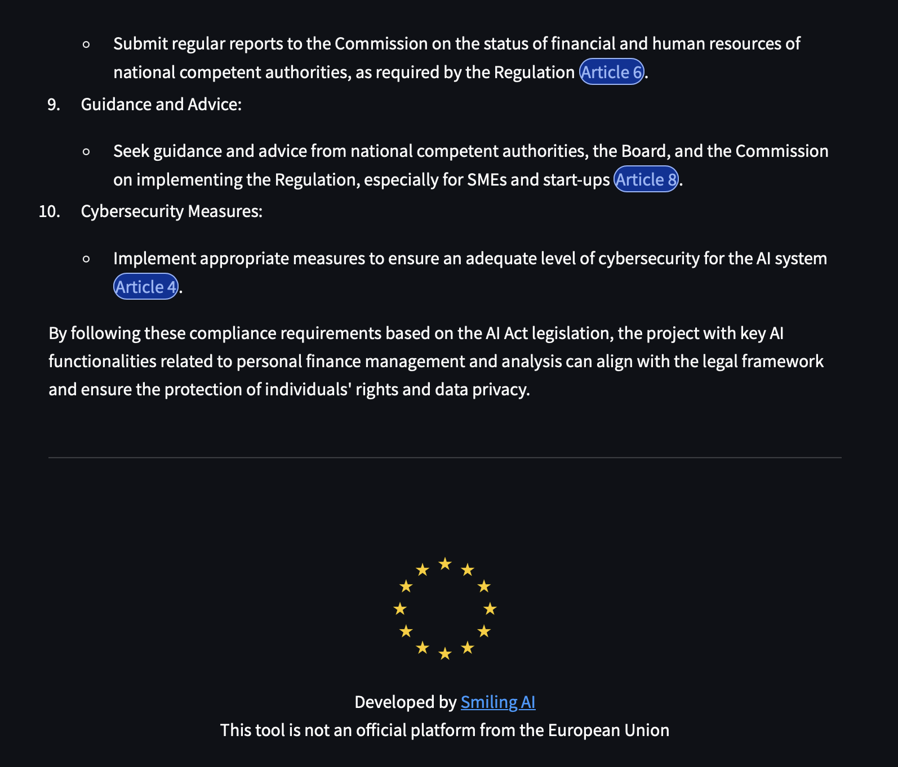

# AI Act Compliance Chatbot

##### Demo PoC Smiling AI : [https://vimeo.com/1071250322](https://vimeo.com/1071250322?share=copy)
##### Video Marketing Smiling AI : [https://vimeo.com/1050775660](https://vimeo.com/1050775660?share=copy#t=0)






## Project Overview

AI Act Compliance Chatbot is a tool designed to help startups and AI developers align their projects with the European Union's AI Act regulations. This chatbot provides tailored guidance on legislation compliance, leveraging the latest legal texts and project descriptions provided by users. It evaluates whether an AI project is likely to comply with EU regulations and flags any potential issues related to the use of banned AI applications.

The primary objectives of this chatbot are:
1. **Guidance**: Offering personalized advice based on the AI Act and specific project descriptions.
2. **Compliance Assessment**: Determining whether a project aligns with the requirements of the EU AI Act and identifying potential risks of non-compliance.

---

## Technology Stack

- **FastAPI**: Backend framework for API endpoints and logic.
- **LangChain**: Powers chatbot interactions and vectorization for enhanced AI processing.
- **Streamlit**: Lightweight, dynamic and user-friendly frontend interface.
- **MongoDB**: Manages project data and user interaction history for efficient storage.


---

## API Overview

### Endpoint: `/chat/aiact`

#### Method: `POST`
#### Description:
This endpoint accepts project descriptions and provides detailed guidance on compliance with the AI Act. It also evaluates whether the project adheres to EU regulations.

#### Request Body (JSON):

```json
{
  "project_description": "Medical Imaging Diagnostics AI-powered tool for identifying abnormalities (e.g., tumors, fractures) in X-rays, MRIs, and CT scans. Computer vision, deep learning for image recognition, integration with radiology system.",
  "max_length": 10000
}

```

## Structure du Projet

```
app/
├── api/                    # Gestion des routes et endpoints de l'API
│   ├── endpoints/          # Endpoints spécifiques par fonctionnalité
│   │   └── chat.py         # Endpoint pour les fonctionnalités de chat
│   └── router.py           # Router principal regroupant tous les endpoints
├── core/                   # Configuration et éléments centraux de l'application
│   └── config.py           # Fichier de configuration principal
├── models/                 # Modèles de données Pydantic
│   ├── chat.py             # Modèle pour les requêtes/réponses de chat
│   └── conversation.py     # Modèle pour la gestion des conversations
├── services/               # Services métier
│   ├── chain.py            # Gestion des chaînes d'exécution pour LangChain
│   ├── llm_service.py      # Service d'interaction avec le LLM (LangChain)
│   ├── memory.py           # Service pour la gestion de la mémoire contextuelle
│   ├── mongo_search.py     # Service de recherche dans MongoDB
│   └── mongo_service.py    # Service pour les opérations MongoDB
├── tools/                  # Utilitaires et fichiers annexes
│   ├── aiact.pdf           # Document PDF du AI Act
│   ├── mangodb_embeddings.py # Gestion des embeddings pour MongoDB
│   ├── page_embeddings.json  # Embeddings pour les pages du AI Act
│   └── text.py             # Utilitaires pour le traitement de texte
├── main.py                 # Point d'entrée principal de l'application
.env                        # Fichier d'environnement pour les configurations sensibles
.env.template               # Modèle du fichier d'environnement
.gitignore                  # Fichier pour ignorer certains fichiers/dossiers dans Git
README.md                   # Documentation principale du projet
```

## Installation et Configuration

### Prérequis
- Python 3.11+ (ici : https://www.python.org/downloads/release/python-3110/ il faut redémarrer après installation pour avoir le $PATH sur l'OS)
- Visual Studio Code avec l'extension Python
- Une clé OpenAI que je vais vous fournir

### Installation

1. **Cloner le projet**
```bash
git clone <URL_DU_DEPOT>
cd <NOM_DU_PROJET>
```

2. **Créer l'environnement virtuel**
```bash
python -m venv venv
```

3. **Activer l'environnement virtuel**
- Windows :
```bash
.\venv\Scripts\activate
```
- macOS/Linux :
```bash
source venv/bin/activate
```

4. **Installer les dépendances**
```bash
pip install -r requirements.txt
```

5. **Configurer la clé API OpenAI**
Créer un fichier `.env` à la racine du projet :
```
OPENAI_API_KEY=votre-clé-api-openai
```


## Explication des Composants

### 1. Main Application (`main.py`)
```python
from fastapi import FastAPI
from fastapi.middleware.cors import CORSMiddleware
```
- Point d'entrée de l'application
- Configure FastAPI et les middlewares
- Initialise les routes

### 2. Modèles (`models/chat.py`)
```python
class ChatRequest(BaseModel):
    message: str
```
- Définit la structure des données entrantes/sortantes
- Utilise Pydantic pour la validation des données
- Version simple pour débuter, extensible pour le contexte

### 3. Service LLM (`services/llm_service.py`)
```python
class LLMService:
    def __init__(self):
        self.llm = ChatOpenAI(...)
```
- Gère l'interaction avec le modèle de langage
- Configure le client OpenAI
- Traite les messages et le contexte

### 4. Router API (`api/router.py`)
```python
@router.post("/chat")
async def chat(request: ChatRequest) -> ChatResponse:
```
- Définit les endpoints de l'API
- Gère les requêtes HTTP
- Valide les données entrantes

## Utilisation de l'API

### Version Simple
```bash
curl -X 'POST' \
  'http://localhost:8000/chat/simple' \
  -H 'Content-Type: application/json' \
  -d '{"message": "Bonjour!"}'
```

### Version avec Contexte
```bash
curl -X 'POST' \
  'http://localhost:8000/chat/with-context' \
  -H 'Content-Type: application/json' \
  -d '{
    "message": "Bonjour!",
    "context": [
      {"role": "user", "content": "Comment vas-tu?"},
      {"role": "assistant", "content": "Je vais bien, merci!"}
    ]
  }'
```

## Debugging avec VS Code

1. Ouvrir le projet dans VS Code
2. Aller dans la section "Run and Debug" (Ctrl + Shift + D)
3. Sélectionner la configuration "Python: FastAPI"
4. Appuyer sur F5 ou cliquer sur le bouton Play
5. Démarrer Swagger : http://127.0.0.1:8000/docs

## Structure de l'API

### Endpoints Disponibles

- `/chat/simple` : Version basique sans contexte
- `/chat/with-context` : Version avancée avec gestion du contexte

### Flux de Données

1. La requête arrive sur l'endpoint
2. Les modèles Pydantic valident les données
3. Le service LLM traite la demande
4. La réponse est formatée et renvoyée

## Progression Pédagogique

1. **Démarrer avec la version simple**
   - Comprendre la structure de base
   - Tester les appels API simples

2. **Évoluer vers la version avec contexte**
   - Ajouter la gestion de l'historique
   - Comprendre l'importance du contexte dans les LLM

3. **Explorer les fonctionnalités avancées**
   - Implémenter des prompts personnalisés
   - Gérer différents types de réponses

## Dépannage

### Problèmes Courants

1. **Erreur de clé API**
   - Vérifier le fichier `.env`
   - S'assurer que la clé est valide

2. **Erreurs de dépendances**
   - Vérifier l'activation du venv
   - Réinstaller les requirements

3. **Erreurs de contexte**
   - Vérifier le format du contexte
   - S'assurer que les rôles sont valides

4. **Powershell**
   - Si les droits admin ne sont pas présent : ''Set-ExecutionPolicy Unrestricted -Scope CurrentUser -Force''

## Ressources

- [Documentation FastAPI](https://fastapi.tiangolo.com/)
- [Documentation LangChain](https://python.langchain.com/)
- [API OpenAI](https://platform.openai.com/docs/api-reference)
